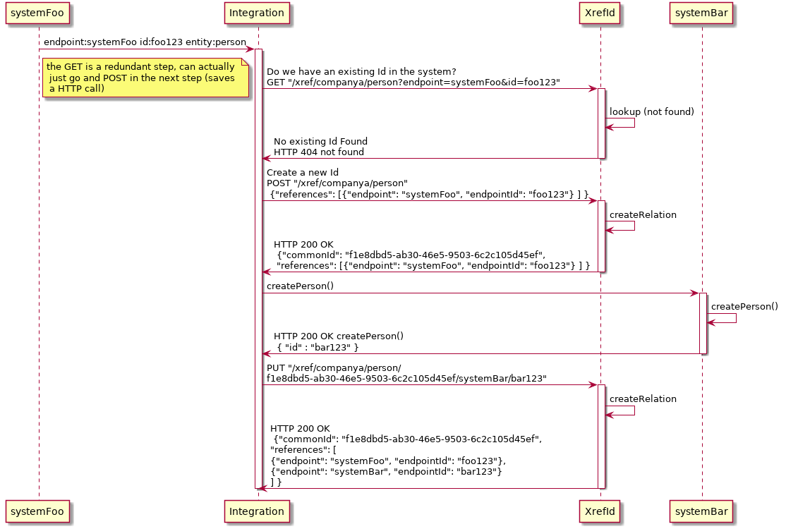
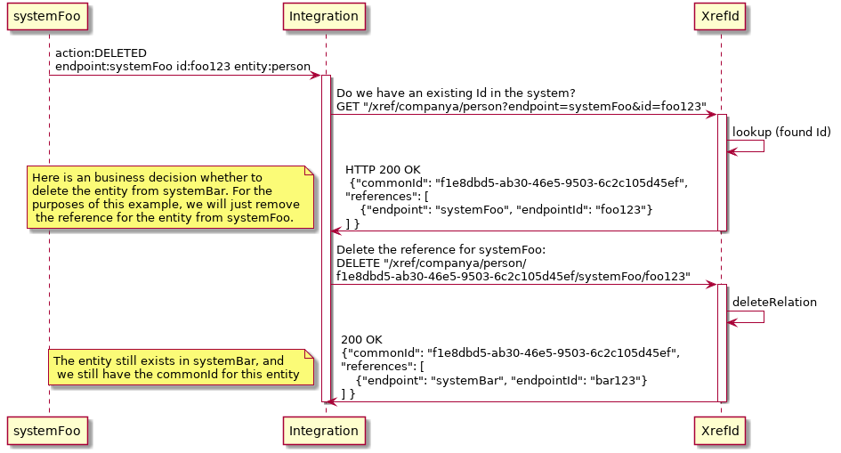

# xref id camel

A simple cross-referencing service for storing ids across different systems.

```$json
{
  "commonID": "ace664a0-1d28-412a-9ea5-0bbf5739f4ce",
  "references": [
    {
      "id": 1,  
      "endpoint": "idm",
      "endpointId": "test.user"
    },
    {
      "id" : 2, 
      "endpoint": "doie",
      "endpointId": "22311415"
    }
  ]
}
```

## Sample Two-system interaction

### Create entity in a new system



### Update or interact with a different system, looking up the id


### Remove a relation

When a system no longer has an entity, the reference to that entity in the XRef service should be removed.




### TODO:

- Run on Openshift (template)
